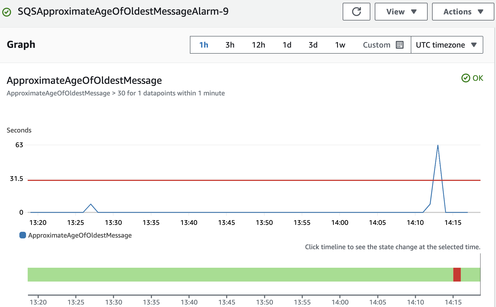

# Dev Ops i Skyen Eksamen 2024
Dette er min besvarelse for 2024 eksamen i emnet "DevOps i Skyen" på Høyskolen Kristiania.

**En tabell med oversikt over leveransene ligger nederst i denne README-filen.**


## Oppgave 1: AWS Lambda
### A. Implementering Lambda-funksjon med SAM og API Gateway

I denne oppgaven har jeg implementert en AWS Lambda-funksjon ved hjelp av AWS SAM (Serverless Application Model). Funksjonen er basert på koden fra generate_image.py og er skrevet i Python. Den eksponeres via et POST-endepunkt gjennom API Gateway.

**Hvordan funksjonen fungerer i praksis:**

* **Mottar en HTTP POST-forespørsel**: Funksjonen trigges når det sendes en POST-forespørsel til API Gateway-endepunktet. Forespørselen inneholder et JSON-objekt med nøkkelen `prompt`, som inneholder teksten som beskriver bildet som skal genereres.

* **Genererer bilde med AWS Bedrock**: Lambda-funksjonen bruker AWS Bedrock til å generere et bilde basert på `prompt`-teksten fra forespørselen.

* **Lagrer bildet i S3-bucket**: Det genererte bildet lagres i S3-bucketen `pgr301-couch-explorers`, med kandidatnummeret mitt som prefiks i objektets nøkkel (f.eks.: `s3://pgr301-couch-explorers/<kandidatnr>/generated_images/titan_12345.png`).

**AWS-tjenester og ressurser som brukes**:

* **AWS Lambda:** Kjører funksjonen som håndterer bildegenerering og lagring.

* **Amazon API Gateway:** Eksponerer Lambda-funksjonen via et HTTP POST-endepunkt, slik at den kan kalles eksternt.

* **AWS Bedrock:** Tjenesten brukes for å generere bildet basert på teksten i `prompt`.

* **Amazon S3:** Lagrer de genererte bildene i den eksisterende bucketen `pgr301-couch-explorers`.

* **IAM Roller og Policyer:** En egendefinert IAM-rolle er opprettet for Lambda-funksjonen, som gir nødvendige tillatelser til å skrive til S3-bucketen og å kalle AWS Bedrock-tjenesten.

**Implementasjonsdetaljer:**

* **Konfigurerbart S3-bucket-navn:** For å unngå hardkoding av bucket-navnet, hentes det fra en miljøvariabel definert i SAM-templatefilen (`template.yaml`). Dette gjør løsningen mer fleksibel og enklere å vedlikeholde.

* **Regionkonfigurasjon:** Lambda-funksjonen og API Gateway er satt opp i regionen `eu-west-1` (Irland). AWS Bedrock-tjenesten brukes i `us-east-1`, men Lambda kan kalle på tvers av region uten problemer.

* **Timeout-innstilling:** Lambda-funksjonens timeout er konfigurert til 30 sekunder for å håndtere tiden det kan ta å generere et bilde. Det har vist seg at det tar rundt 10-12 sekunder å generere et bilde, men hvis 30 sekunder ikke er tilstrekkelig, kan timeout-innstillingen økes.

* **SAM-applikasjon:** SAM brukes til å definere infrastrukturen som kode, inkludert Lambda-funksjonen, API Gateway, IAM-roller og miljøvariabler.

* **Deploy med SAM:** Applikasjonen er deployet til AWS ved hjelp av `sam deploy`, og endepunktet er verifisert til å fungere korrekt.

* **Egendefinert IAM-Rolle:** Den egendefinerte IAM-rollen for Lambda-funksjonen gir nødvendige tillatelser til å skrive til S3 og kalle AWS Bedrock. Dette følger prinsippet om minste privilegier og forbedrer sikkerheten

**Koden og konfigurasjonen ligger i mappen `sam_lambda/` i repositoryet, og er godt kommentert for å forklare detaljer i implementasjonen.**

**Leveranse:**

* **HTTP Endpoint**

    `https://21mwyqqxf9.execute-api.eu-west-1.amazonaws.com/Prod/generate-image`

Funksjonen kan testes ved å sende en POST-forespørsel med JSON-body slik som for eksempel dette:

```json
{
  "prompt": "Ancient egyptians throwing a birthday party in front of the great pyramid"
}
```
---
### B. Opprettelse av GitHub Actions Workflow for SAM-deploy

I denne oppgaven har jeg satt opp en GitHub Actions workflow som automatisk deployer Lambda-funksjonen hver gang det skjer en push til `main`-branchen. Dette sikrer kontinuerlig levering og at funksjonen alltid er oppdatert uten behov for manuell deploy.

**Workflow Detaljer:**

- **Trigger:** Workflowen kjører ved push til `main`-branchen.

- **Jobber i workflowen:**

  - **Sjekker ut koden:** Bruker `actions/checkout@v3` for å hente koden.

  - **Setter opp AWS-legitimasjon:** Konfigurerer AWS Access Key ID og Secret Access Key ved hjelp av `aws-actions/configure-aws-credentials@v2`. Disse er lagret som GitHub Secrets (`AWS_ACCESS_KEY_ID` og `AWS_SECRET_ACCESS_KEY`).

  - **Installerer SAM CLI:** Installerer AWS SAM CLI for å kunne bygge og deploye applikasjonen.

  - **Bygger og deployer applikasjonen:**
    - Kjører `sam build` for å bygge Lambda-funksjonen.
    - Kjører `sam deploy` for å oppdatere funksjonen i AWS. Bruker parametere og miljøvariabler definert i SAM-templatefilen.

**Konfigurasjonsdetaljer:**

- **Region:** Workflowen deployer til `eu-west-1` for å samsvare med infrastrukturen.

- **Miljøvariabler og hemmeligheter:**
  - **AWS Credentials:** Lagrer som GitHub Secrets for sikkerhet.
  - **Andre variabler:** Håndteres gjennom parameterfiler eller miljøvariabler.

- **IAM Rettigheter:** IAM-brukeren brukt av workflowen har nødvendige tillatelser for å kjøre `sam deploy`.

**Fordeler med denne tilnærmingen:**

- **Automatisering:** Eliminerer behovet for manuell deploy.

- **Kontinuerlig levering:** Sikrer at nye kodeendringer raskt blir tilgjengelige.

- **Sikkerhet:** Bruk av GitHub Secrets og begrensede IAM-roller.

**Leveranse:**

- **Lenke til kjørt GitHub Actions workflow:**

  [Vellykket GitHub Actions kjøring](https://github.com/Svendzen/DevOpsExam2024/actions/runs/11801530824)

Sensor kan følge lenken for å se detaljene i workflow-kjøringen og verifisere at deploy ble utført korrekt.

Koden og workflow-filen ligger i `.github/workflows/deploy_lambda.yml` i repositoryet.


## Oppgave 2: Infrastruktur med Terraform og SQS

I denne oppgaven har jeg skrevet Terraform-kode for å konfigurere en AWS Lambda-funksjon som prosesserer meldinger fra en SQS-kø. Lambda-funksjonen er basert på koden i `lambda_sqs.py` og lagrer genererte bilder i S3-bucketen `pgr301-couch-explorers` under kandidatnummeret mitt.


### A. Infrastruktur som kode

**Implementasjon:**

- **SQS-kø:**
  - Opprettet en SQS-kø ved hjelp av `aws_sqs_queue`-ressursen i Terraform.
  - Konfigurert køen med standardinnstillinger og lagret kø-URL-en som en output-variabel.

- **Lambda-funksjon:**
  - Brukte `aws_lambda_function`-ressursen til å definere Lambda-funksjonen.
  - Lastet opp koden fra `lambda_sqs.py`, pakket som en zip-fil ved hjelp av Terraform.
  - Konfigurerte miljøvariabler for S3-bucket og kandidatnummer.
  - **Timeout:** Satt funksjonens timeout til 30 sekunder for å håndtere bildebehandlingen.

- **IAM-roller og policyer:**
  - Opprettet en IAM-rolle for Lambda-funksjonen med nødvendige policyer.
  - Tillatelser inkluderer tilgang til SQS, S3 og AWS Bedrock.

- **Integrasjon mellom SQS og Lambda:**
  - Brukte `aws_lambda_event_source_mapping` for å koble SQS-køen til Lambda-funksjonen.
  - Konfigurerte batch-størrelse og aktivering av mappingen.

- **State-fil lagring:**
  - Terraform state-filen lagres i S3-bucketen `pgr301-2024-terraform-state` under mitt kandidatnummer ved hjelp av en backend-konfigurasjon.

---

### B. GitHub Actions Workflow for Terraform

**Workflow Detaljer:**

- **Trigger:**
  - Workflowen kjører ved push til alle brancher.

- **Jobber i workflowen:**

  - **Sjekker ut koden:** Bruker `actions/checkout@v3`.

  - **Setter opp AWS-legitimasjon:** Konfigurerer AWS Access Key ID og Secret Access Key ved hjelp av `aws-actions/configure-aws-credentials@v2`, lagret som GitHub Secrets.

  - **Installerer Terraform:** Bruker `hashicorp/setup-terraform@v2` for å installere riktig versjon av Terraform.

  - **Kjører Terraform-kommandoer:**
    - Ved push til `main`:
      - Kjører `terraform init` og `terraform apply` for å oppdatere infrastrukturen.
    - Ved push til andre brancher:
      - Kjører `terraform init` og `terraform plan` for å se hvilke endringer som ville blitt gjort.

**Leveranser:**

1. **Lenke til kjørt GitHub Actions workflow (`terraform apply` på `main`):**

   [Vellykket workflow for terraform apply på main branch](https://github.com/Svendzen/DevOpsExam2024/actions/runs/11838298317)

2. **Lenke til kjørt GitHub Actions workflow (`terraform plan` på `test-branch`):**

   [Vellykket workflow for terraform plan på annen branch](https://github.com/Svendzen/DevOpsExam2024/actions/runs/11838167156)

3. **SQS Kø URL:**

    `https://sqs.eu-west-1.amazonaws.com/244530008913/image-generation-queue-9`

    
    Eksempel på hvordan sende melding til køen:

    ```console 
    aws sqs send-message \
    --queue-url "https://sqs.eu-west-1.amazonaws.com/244530008913/image-generation-queue-9" \
    --message-body "En katt og en hund som utforsker verdensrommet sammen, svevende blant stjernene med små astronautdrakter"
    ```

**Koden og konfigurasjonen ligger i mappen `infra/` i repositoryet.**

## Oppgave 3: Javaklient og Docker

Denne oppgaven går ut på å lage et Docker-image av Java SQS-klienten slik at teamet kan bruke klienten uten å måtte ha Java installert lokalt. Klienten sender meldinger til SQS-køen med et bildeprompt som spesifisert fra kommandolinjen.

### A. Dockerfile

**Implementasjon:**

- **Multi-stage build:**
  - Dockerfile er skrevet med en multi-stage strategi for å redusere imagestørrelsen.
  - **Bygg-steg:** Bruker en Maven-basert image for å bygge Java-prosjektet.
  - **Runtime-steg:** Bruker en minimal Java-runtime image for å kjøre den kompilerte JAR-filen.

- **Konfigurasjon:**
  - Dockerfile konfigurerer miljøvariabler som `SQS_QUEUE_URL` for å spesifisere køen klienten skal sende meldinger til.
  - Prompten for bildegenerering tas som et kommandolinjeargument når containeren kjøres.

---

### B. GitHub Actions Workflow for Docker

**Workflow Detaljer:**

- **Trigger:**
  - Workflowen kjører automatisk ved hver push til `main`-branchen.

- **Jobber i workflowen:**

  - **Sjekker ut koden:** Bruker `actions/checkout@v3`.

  - **Logger inn på Docker Hub:** Bruker Docker Hub credentials lagret i GitHub Secrets.

  - **Bygger og publiserer Docker-image:**
    - Docker-imaget bygges fra Dockerfile ved hjelp av `docker build`.
    - Imaget tagges som `svendzen/sqs-client:latest`.
    - Imaget pushes til Docker Hub ved hjelp av `docker push`.

- **Taggestrategi:**
  - Image tagges som `latest` for å alltid reflektere den nyeste, stabile versjonen av klienten.

**Koden og konfigurasjonen ligger i mappen `java_sqs_client/` i repositoryet.**

**Leveranser:**

1. **Beskrivelse av taggestrategi:**
    
    Jeg har valgt å bruke taggen `latest` for container imagene. Dette gjør at imaget alltid viser til den nyeste, stabile versjonen etter en vellykket push til main-branchen. Grunnen til at jeg bruker `latest`, er at det forenkler versjonsstyringen for teamet. Da kan de alltid være sikre på at de bruker den mest oppdaterte versjonen ved å referere til denne taggen. Senere kan det være aktuelt å gå over til en taggestrategi basert på versjonsnumre (som `v1.0`, `v1.1`), for eksempel hvis vi trenger å støtte eldre versjoner eller ruller ut større oppdateringer.

2. **Container image:**
   
  **Docker Hub image:** 
  
  `svendzen/sqs-client:latest`
    
  Med denne kommandoen kan man kjøre imaget og sende en melding til SQS-køen (Legg inn egne AWS Credentials):
  
  ```console 
      docker run -e AWS_ACCESS_KEY_ID=xxx -e AWS_SECRET_ACCESS_KEY=yyy -e SQS_QUEUE_URL=https://sqs.eu-west-1.amazonaws.com/244530008913/image-generation-queue-9 svendzen/sqs-client:latest "A magical salmon going to the moon in a rocket"
  ```

## Oppgave 4: Metrics og overvåkning

 **Viktig!** Legg inn e-postadressen som skal motta varsler i en fil kalt terraform.tfvars under infra-mappen. Bruk variabelen alert_email til dette.

---

Denne oppgaven fokuserer på å sette opp overvåkning for SQS-køen ved hjelp av CloudWatch Metrics og Alarmer for å sikre rask oppdagelse av ytelsesproblemer. Dette er spesielt viktig for å opprettholde en god brukeropplevelse og redusere ventetid for bildegenerering.

**Infrastrukturkode:**

- **CloudWatch-alarm:** Terraform-koden er utvidet med en CloudWatch-alarm som overvåker metrikken `ApproximateAgeOfOldestMessage` for SQS-køen. Denne metrikken måler hvor gammel den eldste meldingen i køen er og kan indikere forsinkelser i behandlingen.

- **Terskelverdi:** Alarmen er konfigurert til å utløses hvis meldingsalderen overskrider en definert terskel, som kan justeres etter behov. Denne terskelen er angitt i Terraform-koden og kan enkelt oppdateres.

- **Varsling via e-post:** Når alarmen utløses, sendes en e-post til en mottaker spesifisert som en variabel i Terraform. E-postadressen er definert i en `terraform.tfvars`-fil for enkel endring uten å måtte oppdatere selve koden.

**Tilnærming:**

- Terraform brukes til å definere CloudWatch-alarmen som kode, noe som sikrer konsistens i oppsettet og enkel reproduksjon.
- Alarmen er knyttet til SQS-køen som ble opprettet i oppgave 2.
- Konfigurasjonen er gjort dynamisk ved å bruke variabler for alarmens terskelverdi og e-postmottaker.

**All nødvendig konfigurasjon finnes i Terraform-koden under `infra/`.**

Slik så det ut når jeg trigget alarmen med en threshold på 30 sekunder:



## Oppgave 5: Serverless, Function as a service vs Container-teknologi

### 1. Automatisering og kontinuerlig levering (CI/CD): Hvordan påvirker serverless-arkitektur sammenlignet med mikrotjenestearkitektur CI/CD-pipelines, automatisering, og utrullingsstrategier?

Automatisering og kontinuerlig levering (CI/CD) er sentralt i moderne utviklingsprosesser. I en serverless arkitektur kan CI/CD-pipelines bli mer komplekse fordi hver funksjon ofte har sin egen livssyklus. Dette betyr at utrullingen må håndtere flere små komponenter, noe som kan føre til økt vedlikeholdsarbeid. Verktøy som Terraform og AWS SAM hjelper med å automatisere denne prosessen ved å definere infrastruktur som kode, slik at både funksjoner og tilhørende ressurser kan rulles ut konsistent.

I mikrotjenestearkitekturer er det færre, men større komponenter, som gjør CI/CD-pipelines mer oversiktlige. Hver tjeneste har sin egen pipeline for bygging, testing og utrulling. For eksempel kan Docker brukes til å bygge containere for hver tjeneste, som deretter distribueres via Docker Hub. GitHub Actions kan integreres for å automatisere bygging og distribusjon av disse containerne, noe vi har gjort i arbeidet med å publisere Java-SQS-klienten.

En fordel med serverless er at infrastrukturen administreres av skyleverandøren, slik at teamet kan fokusere mer på koden og mindre på drift. Dette kan forenkle deler av CI/CD-pipelines ved å eliminere behovet for å konfigurere og vedlikeholde servere. Samtidig kan det være utfordrende å teste funksjoner lokalt, siden de ofte er tett integrert med skytjenester som Amazon SQS og DynamoDB. Verktøy som SAM CLI kan simulere sky-miljøet for å lette lokal testing.

I mikrotjenester er lokal testing ofte enklere, fordi alle avhengigheter kan kjøres som containere ved hjelp av Docker Compose. Dette gir fleksibilitet til å teste hele systemet uten å være avhengig av skytjenester. Likevel krever mikrotjenester mer arbeid med administrasjon av infrastrukturen, spesielt når det gjelder skalering og oppdatering.

Når det gjelder utrullingsstrategier, gir serverless muligheten til å implementere utrulling på funksjonsnivå. Oppdateringer kan rulles ut for en spesifikk funksjon uten å påvirke andre deler av systemet. Mikrotjenester krever ofte utrulling av hele tjenesten, selv ved små endringer, noe som kan øke risikoen for nedetid.

Versjonskontroll er en annen utfordring i serverless. Hver funksjon kan ha sin egen versjon, og det krever nøye oppfølging for å sikre kompatibilitet mellom komponentene. Dette kan være mer komplisert enn i mikrotjenester, hvor hele tjenesten oppdateres som en enhet.

Oppsummert krever serverless arkitekturer mer detaljerte pipelines for hver funksjon, men gir raskere skalerbarhet og distribusjon. Mikrotjenester har enklere CI/CD-strukturer, men krever mer innsats i infrastrukturadministrasjon. Valget mellom disse tilnærmingene avhenger av prosjektets kompleksitet og behovet for fleksibilitet i utvikling og utrulling.

### 2. Observability (overvåkning): Hvordan endres overvåkning, logging og feilsøking når man går fra mikrotjenester til en serverless arkitektur? Hvilke utfordringer er spesifikke for observability i en FaaS-arkitektur?

Overvåkning, logging og feilsøking endrer seg når man går fra en mikrotjenestearkitektur til en serverless arkitektur. I mikrotjenester har man ofte tilgang til hele tjenestens loggdata og ressurser, noe som gjør det enklere å følge en forespørsel gjennom systemet. Ved å samle logger i sentraliserte systemer som Elasticsearch, får man en helhetlig oversikt over ytelse og feil. Docker-containere kan konfigureres til å sende logger til en felles plattform, noe som sikrer konsistent overvåkning.

I en serverless arkitektur, som med AWS Lambda, er applikasjonen delt opp i små, selvstendige funksjoner. Hver funksjon genererer sine egne loggdata, typisk i AWS CloudWatch. Dette kan føre til fragmentert logging, og det kan være utfordrende å spore en forespørsel gjennom flere funksjoner og tjenester som Amazon SQS eller DynamoDB (en NoSQL-databasetjeneste fra AWS). Verktøy som AWS X-Ray kan brukes for å visualisere og feilsøke slike distribuerte systemer ved å samle inn data om hvordan forespørsler flyter gjennom systemet.

Serverless gir fordeler når det gjelder automatisk overvåkning av ytelse og ressursbruk. Tjenester som CloudWatch Metrics kan overvåke spesifikke måledata, som antall forespørsler eller responstid for Lambda-funksjoner. For eksempel har vi brukt Terraform til å sette opp en CloudWatch-alarm på ApproximateAgeOfOldestMessage i en SQS-kø, for å varsle hvis meldinger blir forsinket.

En spesifikk utfordring i serverless er fenomenet "cold starts". Dette skjer når en funksjon må starte opp fra inaktiv tilstand, noe som kan føre til økt responstid. Cold starts kan være vanskelige å oppdage uten spesifikk overvåkning og logging, og kan påvirke brukeropplevelsen negativt.

I mikrotjenester har utviklere full kontroll over applikasjonen og infrastrukturen, noe som gjør det enklere å implementere tilpasset logging og overvåkning. Dette kan være fordelaktig for feilsøking og ytelsesanalyse, men krever mer arbeid for å sette opp og vedlikeholde, spesielt i store systemer med mange tjenester.

Oppsummert gir serverless arkitekturer fordeler med automatisert overvåkning og innebygd skalerbarhet, men krever avanserte verktøy for å håndtere fragmentert logging og feilsøking. Mikrotjenester gir mer kontroll og fleksibilitet i overvåkning, men krever større innsats for å oppnå samme nivå av innsikt. Valget mellom disse tilnærmingene avhenger av behovet for detaljert innsikt kontra enkel konfigurasjon og vedlikehold.

### 3. Skalerbarhet og kostnadskontroll: Diskuter fordeler og ulemper med tanke på skalerbarhet, ressursutnyttelse, og kostnadsoptimalisering i en serverless kontra mikrotjenestebasert arkitektur.

Serverless arkitektur tilbyr betydelige fordeler når det gjelder skalerbarhet. AWS Lambda muliggjør automatisk skalering ved økt trafikk og skalerer ned til null når det ikke er aktivitet. Dette reduserer behovet for manuell ressursadministrasjon. I en mikrotjenestearkitektur kreves det ofte mer arbeid, som å konfigurere autoskalering med EC2-instanser eller Kubernetes. Selv om mikrotjenester gir mer kontroll over ressursene, kan dette være mer tidkrevende.

Når det gjelder kostnader, er serverless ofte kostnadseffektivt for applikasjoner med ujevn eller lav trafikk, siden man kun betaler for faktisk bruk. For eksempel betaler man kun for kjøring av Lambda-funksjoner, mens mikrotjenester ofte kjører på dedikerte ressurser som må betales for kontinuerlig, uavhengig av bruk. Imidlertid kan kostnadene ved serverless øke raskt hvis trafikken er høy og jevn over tid, noe som gjør det viktig å overvåke kostnadene nøye ved hjelp av verktøy som AWS Cost Explorer eller CloudWatch.

I systemer som bruker meldingskøer som Amazon SQS, kan det oppstå forsinkelser hvis meldinger hoper seg opp. CloudWatch-metrikken ApproximateAgeOfOldestMessage kan gi verdifull innsikt i systemets ytelse. Serverless arkitekturer gjør det enklere å skalere individuelle funksjoner for å håndtere slike scenarioer, men krever mer overvåkning for å sikre at alle komponenter fungerer optimalt.

Mikrotjenester gir ofte mer forutsigbare kostnader fordi ressursbruken er mer stabil. Dette kan være en fordel ved budsjettering, men gir mindre fleksibilitet til å optimalisere kostnader for arbeidsbelastninger som varierer. Serverless gir større fleksibilitet ved dynamiske behov, men krever god innsikt i systemet for å holde kostnadene under kontroll.

En hybrid tilnærming kan være fordelaktig, der man bruker serverless for deler av systemet med uforutsigbar trafikk og mikrotjenester for oppgaver med jevn belastning. Dette kombinerer styrkene fra begge arkitekturer. Valget mellom serverless og mikrotjenester bør baseres på forståelse av applikasjonens behov, trafikkmønster og tilgjengelige ressurser.

### 4. Eierskap og ansvar: Hvordan påvirkes DevOps-teamets eierskap og ansvar for applikasjonens ytelse, pålitelighet og kostnader ved overgang til en serverless tilnærming sammenlignet med en mikrotjeneste-tilnærming?

Overgangen til en serverless arkitektur endrer DevOps-teamets ansvar for applikasjonens ytelse, pålitelighet og kostnader. I en serverless tilnærming, som med AWS Lambda, tar skyleverandøren hånd om mye av den operasjonelle driften, inkludert serveradministrasjon, skalering og oppdateringer. Dette lar teamet fokusere mer på kjernefunksjonalitet og mindre på infrastruktur.

Samtidig må teamet være oppmerksom på kostnadskontroll, siden betalingen er basert på faktisk bruk. Ineffektive funksjoner eller dårlig utformede arbeidsflyter kan føre til uforutsette kostnader. Bruk av verktøy som Terraform for å definere og overvåke ressurser kan gi bedre oversikt og kontroll over infrastrukturen, og bidra til å unngå kostnadsoverraskelser.

I en mikrotjenestearkitektur har DevOps-teamet større ansvar for infrastrukturen. De må konfigurere, vedlikeholde og skalere tjenestene manuelt eller ved hjelp av egne verktøy. Docker-containere og orkestreringssystemer som Kubernetes brukes ofte til dette. Selv om dette gir mer kontroll over applikasjonens ytelse og pålitelighet, krever det også mer tid og teknisk kompetanse.

Når det gjelder pålitelighet, gir serverless innebygd høy tilgjengelighet, siden funksjonene kjøres på administrerte tjenester som automatisk skalerer ved behov. Dette kan redusere risikoen for nedetid. Mikrotjenester kan være mer utsatt for feil hvis de ikke er riktig konfigurert eller overvåket, men gir mulighet for tilpasninger som kan forbedre ytelsen.

Eierskapet til applikasjonens livssyklus blir mer fragmentert i en serverless arkitektur. Siden hver funksjon kan deployeres og administreres separat, må teamet ha klare strategier for versjonskontroll og overvåkning. Dette kan kompliseres hvis funksjonene interagerer med ulike tjenester som Amazon SQS eller DynamoDB, hver med sine egne konfigurasjoner.

I mikrotjenester beholder teamet fullt eierskap over hele applikasjonen og infrastrukturen, noe som gir mer kontroll, men også mer ansvar. Automatisering gjennom CI/CD-pipelines, som med GitHub Actions, er viktig for effektiv utrulling og endringshåndtering i begge arkitekturer.

Oppsummert gir serverless fordeler som redusert operasjonelt ansvar og innebygd skalerbarhet, men krever nøye kostnadskontroll og koordinering. Mikrotjenester gir større fleksibilitet og kontroll, men krever mer innsats fra teamet for å sikre ytelse og pålitelighet. Valget mellom disse tilnærmingene bør baseres på prosjektets behov for skalerbarhet, kontroll og tilgjengelige ressurser.

## Oppsummering av leveranser
* **Oppgave 1**
  * **Leveranse 1:** HTTP Endepunkt for Lambda-funksjonen
    
    `https://21mwyqqxf9.execute-api.eu-west-1.amazonaws.com/Prod/generate-image`
  
  * **Leveranse 2:** Lenke til kjørt GitHub Actions workflow for SAM-applikasjon på AWS

    [Vellykket kjøring av GitHub Actions workflow som har deployet SAM-applikasjonen til AWS.](https://github.com/Svendzen/DevOpsExam2024/actions/runs/11801530824)
    
* **Oppgave 2**
  * **Leveranse 1:** Lenke til kjørt GitHub Actions workflow på main:
 
    [Vellykket workflow for terraform apply på main](https://github.com/Svendzen/DevOpsExam2024/actions/runs/11838298317)

  * **Leveranse 2:** Lenke til en fungerende GitHub Actions workflow på en annen branch

    [Vellykket workflow for terraform plan på annen branch](https://github.com/Svendzen/DevOpsExam2024/actions/runs/11838167156)
    
  * **Leveranse 3:** SQS-Kø URL
  
    `https://sqs.eu-west-1.amazonaws.com/244530008913/image-generation-queue-9`

* **Oppgave 3:**
  * **Leveranse 1:** Beskrivelse av tagge-strategi

    Jeg har valgt å bruke taggen `latest` for container imagene. Dette gjør at imaget alltid viser til den nyeste, stabile versjonen etter en vellykket push til main-branchen. Grunnen til at jeg bruker `latest`, er at det forenkler versjonsstyringen for teamet. Da kan de alltid være sikre på at de bruker den mest oppdaterte versjonen ved å referere til denne taggen. Senere kan det være aktuelt å gå over til en taggestrategi basert på versjonsnumre (som `v1.0`, `v1.1`), for eksempel hvis vi trenger å støtte eldre versjoner eller ruller ut større oppdateringer.

  * **Leveranse 2:** Dockerhub image
    
    `svendzen/sqs-client:latest`

* **Oppgave 4:**

  Koden finnes under `infra/` mappen.

* **Oppgave 5:**

  Besvarelsen finnes i denne README-filen i seksjonen for oppgave 5.
